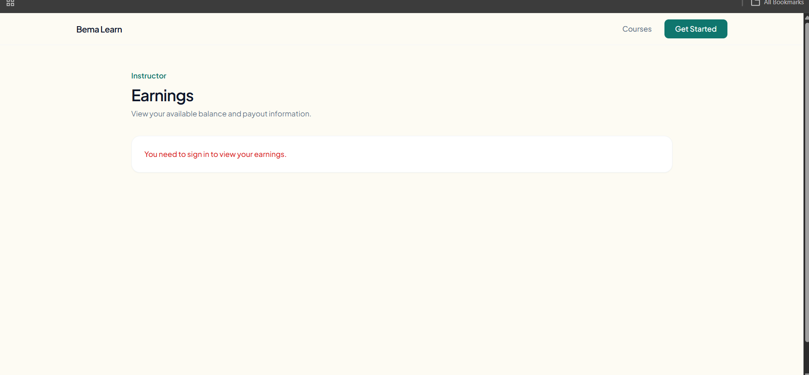
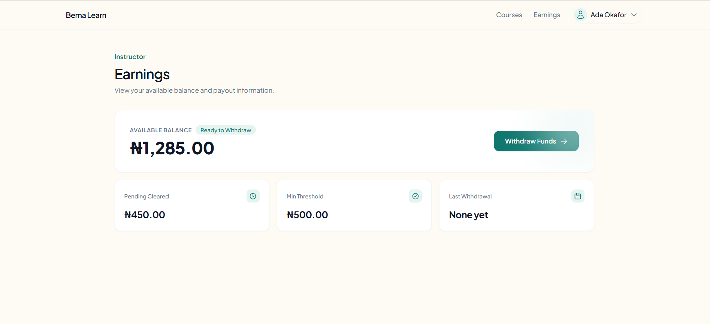
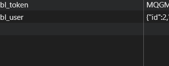
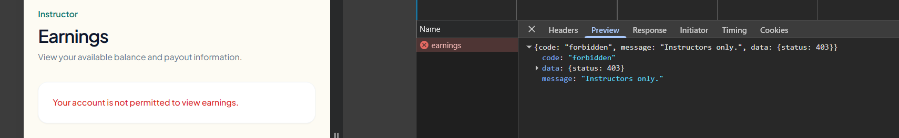

# Evidence

Put your screenshots and terminal output here.

Suggested names:

- task-1-ui.png, task-1-network.png ( and network )

- task-2-signedout.png (), task-2-signedin.png(), task-2-network.png() ()

- task-3-validation.png, task-3-server-error.png, task-3-success.png, task-3-network.png () () ()
- task-4-curl.txt TASK 4 — DEFECT 1: PERMISSION
BEFORE
Confirmed during discovery: using a learner account token against
GET /me/earnings returned 200 OK with real earnings/ledger data, instead of
the contract-required 403. Raw output was not saved before applying the fix.

AFTER
Learner token → GET /me/earnings:

HTTP/1.1 403 Forbidden
Content-Type: application/json; charset=UTF-8

{"code":"forbidden","message":"Instructors only.","data":{"status":403}}


TASK 4 — DEFECT 2: SCHEMA MISMATCH
BEFORE
GET /courses/1 returned lessonCount: 0 for every course, because the code
read a non-existent column (lessons_total) instead of the real column
(lesson_count). Raw output prior to the fix was not saved.

AFTER
GET /courses/1:

{"id":1,"title":"Introduction to Bread Baking","instructorName":"Ada Okafor","priceMinor":4500,"currency":"NGN","enrolmentCount":128,"averageRating":4.6,"publishedAt":"2026-03-14T08:00:00+00:00","isPublished":true,"description":"Introduction to Bread Baking - a short course for the assessment environment.","lessonCount":12}


TASK 4 — DEFECT 3: PUBLISHED COURSES ONLY
BEFORE
Confirmed during discovery: GET /courses returned 5 courses, including the
unpublished "Advanced Laminated Dough" (id 5), which the contract says must
never appear in the public list. Raw output prior to the fix was not saved.

AFTER
GET /courses — 4 courses returned, unpublished course no longer present:

{
  "courses": [
    {"id":4,"title":"Cake Decorating Basics","instructorName":"Ada Okafor","priceMinor":3000,"currency":"NGN","enrolmentCount":9,"averageRating":0,"publishedAt":"2026-06-11T08:00:00+00:00","isPublished":true},
    {"id":3,"title":"Pastry Fundamentals","instructorName":"Ada Okafor","priceMinor":7500,"currency":"NGN","enrolmentCount":null,"averageRating":null,"publishedAt":"2026-05-20T08:00:00+00:00","isPublished":true},
    {"id":2,"title":"Sourdough Starters","instructorName":"Ada Okafor","priceMinor":6000,"currency":"NGN","enrolmentCount":64,"averageRating":4.2,"publishedAt":"2026-04-02T08:00:00+00:00","isPublished":true},
    {"id":1,"title":"Introduction to Bread Baking","instructorName":"Ada Okafor","priceMinor":4500,"currency":"NGN","enrolmentCount":128,"averageRating":4.6,"publishedAt":"2026-03-14T08:00:00+00:00","isPublished":true}
  ],
  "previewExpiresInSeconds": 300
}


TASK 4 — DEFECT 4: MINIMUM WITHDRAWAL
BEFORE
Not captured separately — the fix (below_minimum check) was applied before
isolated "before" testing was run against this endpoint.

AFTER
POST /me/withdrawals {"amountMinor":100,"payoutReference":"task4-after-final"}:

HTTP/1.1 422 Unprocessable Entity
Content-Type: application/json; charset=UTF-8

{"code":"below_minimum","message":"Withdrawal amount is below the minimum allowed.","data":{"status":422}}


- task-5-queries.txt
- task-7-output.txt

---

## Before you commit anything here

**Redact bearer tokens.** Where a screenshot shows the `Authorization` header,
the header itself must stay readable — that is the evidence — but the token
value must be blacked out or blurred:

```
Authorization: Bearer ███████████ (redacted)
```

The same applies to terminal output pasted into `task-4-curl.txt`: keep the
request and response, replace the token with `<redacted>`.

The seeded test logins (`assessment123` and the local database credentials) are
**not** secrets — they are published in this package on purpose and are local to
your machine. A live session token is different: redact it.
